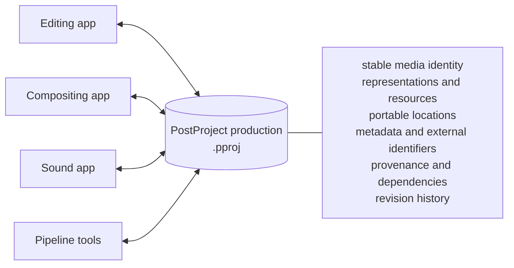

# PostProject

**PostProject is a shared media-knowledge layer for post-production software.**

Editing, compositing, sound, ingest, review, and delivery tools often know about the same media but describe it separately. PostProject gives those tools a common local production database for the facts that should survive application boundaries: what a piece of media is, which representations belong to it, where those representations can be found, what metadata is known about them, and how derived media was produced.

PostProject does **not** replace an editor, compositor, timeline format, decoder, or asset-management UI. Applications keep their own project data and workflows. PostProject supplies shared production knowledge underneath them.

- Project overview: <https://postproject.org>
- Documentation: <https://docs.postproject.org>
- Source and releases: this repository

## The idea in one picture



A PostProject **asset** is the logical thing people and applications mean when they say “this clip,” “this still,” or “this piece of media.” A file path is only one place where one representation of that asset happens to be reachable.

That distinction lets applications keep referring to the same media when files move, when a proxy is created, when a sequence contains thousands of frames, or when another application continues the work.

## What PostProject helps applications share

PostProject currently provides building blocks for:

- **Stable identity.** Refer to media independently of a particular path or application project file.
- **Representations.** Keep originals, proxies, optimized media, derived results, image sequences, recording spans, and package-like media connected to the same logical asset.
- **Portable locations.** Describe storage through logical roots and locators so productions can move between machines without rewriting their meaning.
- **Deterministic relinking.** Use fingerprints and explicit evidence to find moved media without silently choosing between ambiguous candidates.
- **Metadata.** Store typed, repeatable assertions while preserving vocabulary namespaces and external identifiers.
- **Provenance.** Record activities, inputs, outputs, tools, and parameters so applications can explain where media came from.
- **Artifact knowledge.** Describe dependencies, freshness, and reproducibility of managed outputs without turning PostProject into the executor itself.
- **Change tracking.** Consume semantic revisions so another application can react to production changes without polling every table.

For the conceptual model, start with the [documentation](https://docs.postproject.org) rather than the generated API reference.

## What PostProject deliberately does not own

PostProject is infrastructure, not an all-in-one production application. In particular, it does not try to become:

- an editing or compositing model;
- a timeline interchange format;
- a decoder or encoder framework;
- a render farm or scheduler;
- a cloud collaboration service;
- a universal metadata ontology;
- a replacement for OpenTimelineIO or OpenAssetIO.

Those systems can integrate with PostProject when they need shared media identity and production knowledge.

## Public integration surfaces

Rust is the implementation language, but downstream applications do not need to embed Rust or Cargo.

The supported integration surfaces are:

- **C ABI** for the stable native boundary;
- **C++17** wrapper API;
- **Python** bindings built over the C ABI;
- **CLI** for inspection, scripting, testing, and operational workflows.

The Rust crates remain useful for contributors and Rust-native experimentation, but native consumers should treat the C ABI as the portability boundary.

## Try the workflow from the command line

The CLI is the quickest way to understand the model without writing an integration. `ASSET_ID` stands for an ID printed by `media add` or `media list`; `--inspect` needs `ffprobe`, and every `--root-map` directory must exist on the local machine.

```sh
cargo run -p postproject-cli -- init production.pproj --name "Documentary"
cargo run -p postproject-cli -- media add production.pproj examples/fixtures/sample-media.dat
cargo run -p postproject-cli -- media add production.pproj camera.mov --inspect
cargo run -p postproject-cli -- media list production.pproj
cargo run -p postproject-cli -- root add production.pproj rushes --label "Camera originals"
cargo run -p postproject-cli -- media resolve production.pproj ASSET_ID --root-map rushes=/mnt/show/rushes
cargo run -p postproject-cli -- media resolve production.pproj ASSET_ID --verify
cargo run -p postproject-cli -- media inventory production.pproj --root-map rushes=/mnt/show/rushes --cache .cache/inventory.json
cargo run -p postproject-cli -- --json revisions since production.pproj --after 0
```

For a guided explanation of what each step means, see the **Portable production workflow** in the documentation site.

## Integrate a native application

Release packages are consumed without Cargo. To build and install the native package from a source checkout on Linux:

```sh
cargo build --release --locked -p postproject-ffi
cmake -S . -B target/package \
  -DPOSTPROJECT_LIBRARY="$PWD/target/release/libpostproject.so" \
  -DPOSTPROJECT_STATIC_LIBRARY="$PWD/target/release/libpostproject.a" \
  -DCMAKE_INSTALL_PREFIX="$PWD/target/install"
cmake --install target/package
```

A minimal C consumer opens a production through the public ABI and releases every owned handle:

```c
#include <postproject/postproject.h>

pp_production_t *production = NULL;
pp_error_t *error = NULL;
if (pp_production_open("production.pproj", &production, &error) != PP_OK) {
    pp_error_release(error);
    return 1;
}
pp_production_release(production);
```

The installed package exports `PostProject::postproject` for CMake and `postproject` for `pkg-config`. Platform packages use the normal native library form for the system (`.dylib` on macOS; the matching import library and `postproject.dll` on Windows).

The integrator documentation covers installation, C/C++/Python quickstarts, ownership rules, transactions, media resolution, metadata, provenance, revision consumption, and jobs.

## Build and test the repository

Rust 1.85 or newer is required for the current source tree. For contributors, the normal workspace build and test commands are:

```sh
cargo build --workspace
cargo test --workspace --all-features
```

The repository is split into domain, media/filesystem, SQLite persistence, FFI, CLI, language bindings, examples, fuzzing, and documentation components. The contributor guide explains which layer owns which responsibility and which changes require coordinated updates.

## Build the documentation site

The documentation site combines hand-written guides with generated native API reference. Python 3.12 or newer, the packages in `docs/requirements.txt`, and Doxygen are required for the current documentation build:

```sh
mkdir -p target/doxygen
doxygen Doxyfile
python tools/normalize_doxygen_xml.py target/doxygen/xml
python tools/check_docs_coverage.py include/postproject/postproject.h target/doxygen/xml
sphinx-build --fail-on-warning --keep-going -b html docs target/postproject
```

Use <https://docs.postproject.org> for the published documentation.

## Project status and compatibility

PostProject is in alpha development; the current development version is
`0.7.0-alpha.1` with C ABI version 51 and SQLite schema 19. It is an unpublished
API-safety candidate. The latest release is `0.6.0-alpha.1`. Its C++17 Result
propagation protocol (`Result<T>`, including `Result<void>`, `POSTPROJECT_TRY`
and `POSTPROJECT_TRY_ASSIGN`) remains source-compatible within `0.6.x`.
Development APIs are experimental. Consumers should
pin an exact release or commit and check the [ABI policy](docs/abi-policy.md)
before depending on a particular interface.

The important distinction is intentional: **production data should be durable even while APIs are still being refined.** Compatibility promises are therefore documented explicitly rather than implied by version numbers alone.

## Where to go next

If you are evaluating PostProject, read **Start here** in the docs. If you are adding it to an application, use the **Integrator guide**. If you are changing PostProject itself, use the **Contributor guide** and engineering references.

PostProject is dual-licensed under the MIT License or Apache License 2.0, at your option (`MIT OR Apache-2.0`). Contribution and security policies are described in the repository files.
