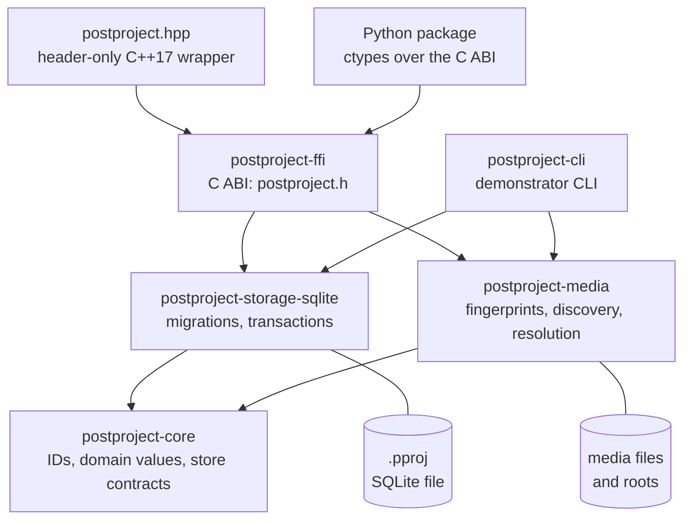

# Architecture

## Boundaries and dependency direction

Arrows point toward dependencies; `postproject-ffi` and `postproject-cli` also
depend on `postproject-core` directly.

`postproject-core` owns stable IDs, domain values, errors, transaction semantics,
and domain-oriented service contracts. It has no dependency on SQLite, C/C++, Qt,
or any editor. Every other component may depend on core; core never depends on an
adapter.

`tools/check_architecture.py` enforces production dependency direction in CI,
including optional, renamed and platform-specific dependencies. Core's direct
libraries are explicitly reviewed. Every crate outside the FFI adapter must
inherit the workspace's compiler-enforced prohibition on unsafe code.
Test-only dependencies are separate: storage tests may use media services to
exercise the backend through domain operations.

The experimental `postproject-protocol` crate depends on core and owns strict
wire validation and canonical encoding (ADR 0065). It cannot depend on media,
storage or application adapters. Core remains independent of the codec.

`postproject-storage-sqlite` owns production-file migrations and transactional
persistence. It implements the core `ProductionRead`, `ProductionStore`, and
`ProductionStoreTransaction` contracts, which describe domain operations rather
than generic row CRUD. A later backend can implement the same boundary without
exposing its connection or query model.

`postproject-media` owns filesystem candidate discovery, fingerprinting,
resolution policy, optional inspection, and the bounded local-executor adapter.
Candidate discovery, cheap filtering, and expensive verification remain
separate so indexing can be introduced without changing the domain result
types. `ffprobe` and `ffmpeg` are configurable subprocess capabilities; no
FFmpeg library enters the dependency graph.

`postproject-ffi` exposes a manually designed C ABI with opaque handles and panic
containment. The header-only C++ wrapper calls only that ABI. `postproject-cli`
depends on the domain, media, and SQLite crates and exercises those services
without reimplementing their behavior.

## Why a C ABI

Rust provides memory safety and expressive domain modeling internally, while a C
ABI gives downstream C, C++, Qt, Python, and GObject consumers a conventional,
toolchain-neutral integration boundary. Rust types, layouts, panics, and ownership
conventions must not cross it.

## Current direction and deferred concerns

The 0.4 development release adds fingerprint observations and activity snapshots,
managed-artifact evaluation, dependency relationships, and durable jobs in that
domain-first order. Each capability reaches persistence before the public C ABI
and language wrappers are expanded around it.

Timelines, collaboration, networking, media decoding, implicit job execution,
full standards adapters, and editor-specific models remain outside the
architecture.
