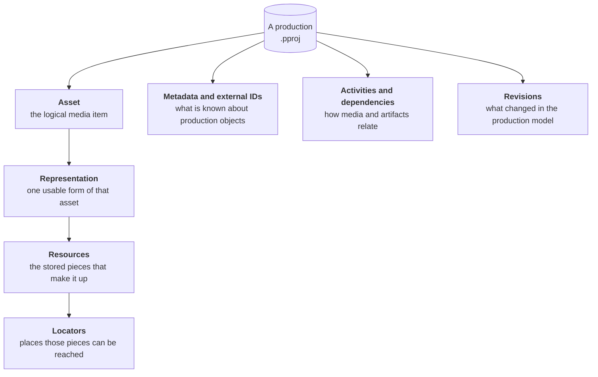

# PostProject documentation

PostProject gives post-production applications a **shared memory for media**. Each application keeps its own editing, compositing, timeline, and project data; PostProject stores the production knowledge that should remain meaningful between tools.

If you have just arrived from [postproject.org](https://postproject.org), this site is the next step: it explains how the model works, how to use it in a production, and how to integrate it into software.

## Choose your path

### I want to understand PostProject

Start with {doc}`src/getting-started/README`. It explains the problem PostProject solves and introduces the core model without requiring API knowledge.

Then read {doc}`src/getting-started/core-model` for the four most important objects: assets, representations, resources, and locators.

### I want to use a PostProject-enabled application or the CLI

Read {doc}`src/users/README`, then follow the {doc}`src/users/portable-production-workflow`.

The user guides focus on practical questions such as moving a production to another machine, handling image sequences, checking whether media is still available, and understanding metadata and provenance.

### I want to add PostProject to an application

Go to {doc}`src/integrators/README`. It gives a recommended integration order, explains which API surface to choose, and links a task guide for every capability. Each guide shows the same operation in C, C++, Python, Rust, and the CLI, taken from programs that CI compiles and runs.

### I want to understand the data model precisely

Use {doc}`src/concepts/README` as the map. Concept pages define semantics; generated API pages define exact signatures.

### I want to contribute to PostProject

Start with {doc}`src/contributors/README` and {doc}`src/project/README`. Architectural decisions, release reports, benchmarks, fuzzing notes, and persistence details are engineering reference material rather than required introductory reading.

## A useful mental model



A path is deliberately **not** the identity of an asset. Moving a file should change where it is found, not what it is.

## Documentation layers

The documentation is organized so you do not need to read implementation detail before understanding the product:

1. **Start here** — plain-language model and terminology.
2. **Using PostProject** — production workflows and operational behavior.
3. **Integrating PostProject** — application-facing rules and tested examples.
4. **Concepts** — precise semantic definitions shared across languages.
5. **Reference** — exact native and language-binding signatures, tested example programs, terminology, vocabularies, and standards mappings.
6. **Project & engineering** — contribution rules, architecture, persistence, tests, release history, and ADRs.

```{toctree}
:maxdepth: 2
:caption: Start here

src/getting-started/README
src/getting-started/core-model
```

```{toctree}
:maxdepth: 2
:caption: Guides

src/users/README
src/integrators/README
src/concepts/README
```

```{toctree}
:maxdepth: 2
:caption: Reference

src/reference/README
```

```{toctree}
:maxdepth: 2
:caption: Project & engineering

src/project/README
```
