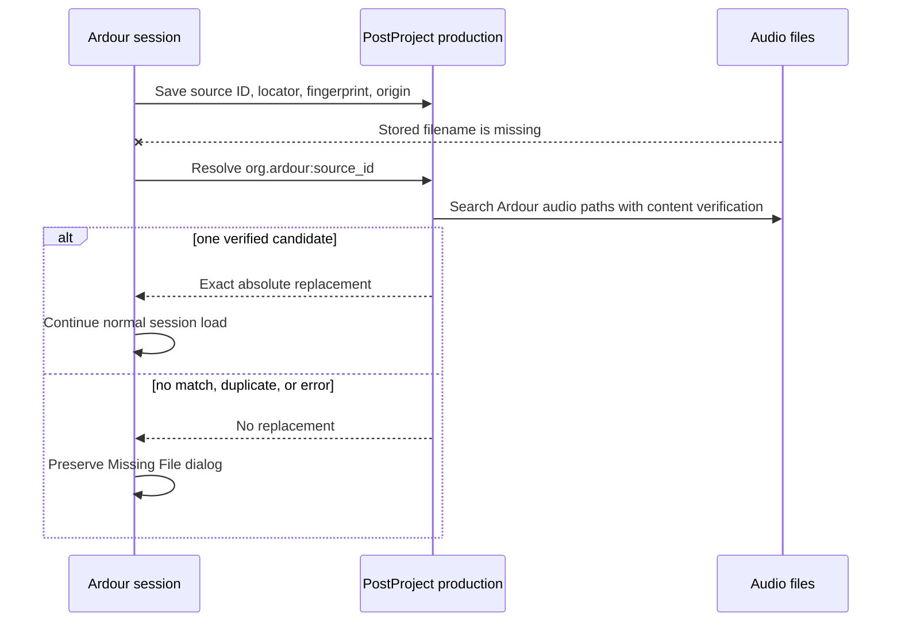

# PostProject 0.5 Ardour pilot evidence

The compatibility evidence review selected one additional integration route:
an Ardour resolver pilot. It addresses three gaps left by the maintained shared
production scenario: installed `pkg-config` discovery, exception-enabled C++
use, and audio-domain media. Shotcut and a raw-C GES shim were not selected.

The pilot is maintained as a patch series against Ardour commit
`7968ec504ba8b70e6de5c09d0470264581a5e979`. Ardour uses only the installed
header, shared library, and `postproject.pc`; its build never invokes Cargo.

## Integration shape

The production is explicit. An existing `.pproj` is selected before Ardour is
started:

```sh
export ARDOUR_POSTPROJECT_PRODUCTION=/show/audio/shared.pproj
ardour /show/audio/mix-session
```

No environment variable, no discovered package, or the explicit
`--no-postproject` configure option produces upstream behavior.



After a successful session save, regular file-backed audio sources are recorded
with revision origin `org.ardour` and external identifier
`org.ardour:source_id`. An asset at the exact current locator may be adopted;
content equality alone never merges assets. During recovery the persisted
source ID identifies the asset without attempting to construct a canonical URI
for a path that no longer exists. One content-verified known locator or one
exact discovered candidate is accepted. Ambiguity has no automatic winner.

The PostProject-specific code is split between a small Ardour boundary and a
host-neutral resolver. `Result<T>::value()` follows Ardour's normal exception
style. The boundary catches `postproject::Exception` and `std::exception`, logs
the diagnostic, and preserves the existing recovery dialog.

## Verification evidence

On 2026-10-01 the executable resolver scenario passed locally against the
installed native package. It:

- compiled the production resolver using flags from `postproject.pc`;
- wrote valid one-second, 48 kHz stereo WAV audio;
- recorded it, renamed it, and recovered the new name by content;
- introduced a second content-identical file and received no selection;
- confirmed the moved path on a later save and recovered it as a verified known
  locator;
- read the `org.ardour` revision origin and `org.ardour:source_id` binding;
- caught a typed exception from a failed `Result<T>::value()` call.

The actual adapter translation unit also compiled against the pinned Ardour
headers in the local source tree. Replaying the exported patch series from the
pin produced the same nested tree. The complete Waf build could not be run in
this Gentoo workspace because its system dependency set lacks Ardour's
mandatory `liblo` development package. The maintained downstream workflow
defines full Arch Linux builds with and without PostProject and a macOS
installed-package resolver job; those definitions are not counted here as
remotely executed evidence.

The resolver scenario uses the exact production policy compiled into Ardour,
but it is not an interactive application path. Its ABI trace is therefore not
added to the compatibility family-to-host matrix. The matrix continues to
count only the maintained normal host paths recorded in the generated evidence
report.

## Limitations

Interactive Ardour UI verification has not been performed. Production
selection is an environment variable rather than an Ardour preference.
Fingerprinting after saves and content search during a synchronous missing-file
callback can take noticeable time with large sources or broad search paths.
MIDI, silent, playlist, and non-file sources retain upstream behavior.

Waveform peak files remain private caches without a per-output claim, progress,
failure, or cancellation lifecycle. The pilot does not present them as managed
artifacts or jobs. It likewise makes no inferred recipe claim for bounces,
freezes, or consolidated audio.

