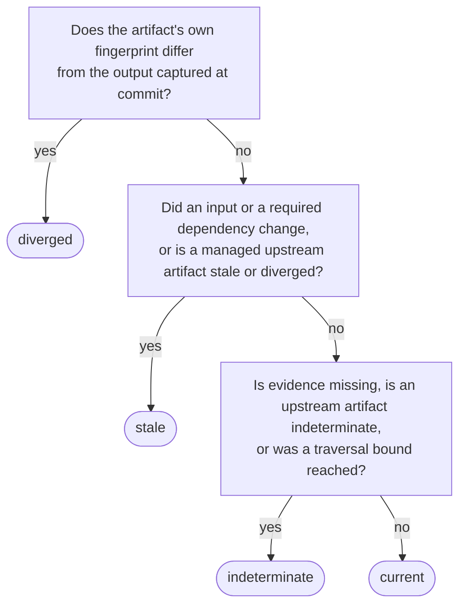

# Artifact knowledge and reproducibility

A managed artifact is a representation produced by a recorded activity, such
as an editing proxy or render. PostProject derives what it knows about that
artifact from the activity graph and the fingerprint snapshots captured on the
activity's input and output edges.

The knowledge state is one of:

- **current** — comparable input and output fingerprints still match, and
  every managed upstream artifact is current;
- **stale** — an input changed or a managed upstream artifact is not current;
- **indeterminate** — the production lacks a snapshot or comparable
  fingerprint evidence;
- **diverged** — the artifact's own fingerprint differs from the output
  captured when the activity committed.

This state is computed, not stored. Evaluation is knowledge-only: it does not
read media files, resolve locations, compute fingerprints, enqueue work, or
change the production. A caller records a new fingerprint observation
explicitly before evaluation can account for changed content.

Required [dependency relationships](dependencies.md) are captured with an
activity input. A changed dependency path or fingerprint can therefore make a
generated artifact stale without classifying the referencing source itself as
stale.

When several conditions apply at once, the most severe state wins, in the
order the questions are asked here:



## Explanations and bounds

Every non-current evaluation includes structured reasons. Depending on the
condition, a reason identifies the activity, input or output edge,
representation, fingerprint algorithm and version, captured and current byte
values, upstream state, or traversal limit. Applications should present these
reasons instead of reducing the answer to an unexplained warning.

Transitive evaluation has explicit depth and representation-count bounds. If a
bound is reached, the result is truncated and indeterminate rather than
silently treating the unexplored graph as current.

To find stale artifacts across a production, or among the provenance
descendants of one changed source, use the paginated
[stale-artifact query](../integrators/bounded-queries.md) instead of evaluating
every output individually.

Activities created before edge snapshots were introduced retain absent
snapshots after migration. Their outputs are indeterminate until regenerated;
PostProject never fabricates historical evidence from current values.

## Three independent dimensions

Artifact knowledge does not include file availability or job state:

| Dimension | Answers | Values |
| --- | --- | --- |
| Knowledge | Does the artifact still match what produced it? | current · stale · indeterminate · diverged |
| Availability | Can its content be reached on this machine? | online · partial · offline · ambiguous · error |
| Work | Is work on it wanted or did it fail? | pending · failed · none |

For example, a stale proxy may still be online, while a current render may be
offline on this machine. Read resolution results and job state separately when
the interface needs all three answers.

## Reproducibility report

The reproducibility operation reports whether the production records:

- one unambiguous producing activity;
- that activity's kind and tool identity;
- typed parameter metadata on the activity; and
- every referenced input representation.

It returns every missing condition, not only a boolean. A positive report says
the production has enough recorded knowledge to describe the work; it does not
promise that the tool, input files, codecs, or execution environment are
currently available, and it never runs the activity.

The C and C++ APIs expose owned evaluation and reproducibility results, Python
provides immutable value objects through `Production.evaluate_artifact()` and
`Production.artifact_reproducibility()`, and the CLI exposes `artifact
evaluate` and `artifact reproducibility` with structured JSON output.

## Across public surfaces

Evaluation and reproducibility are separate read-only questions. This example
reports both and preserves the structured reasons or missing conditions:

```{code-variants} artifact-knowledge
```

Staleness begins with an explicitly recorded change. After a new fingerprint
observation of an input, the artifact evaluates as stale with reasons that name
the changed input:

```{code-variants} stale-after-change
```
