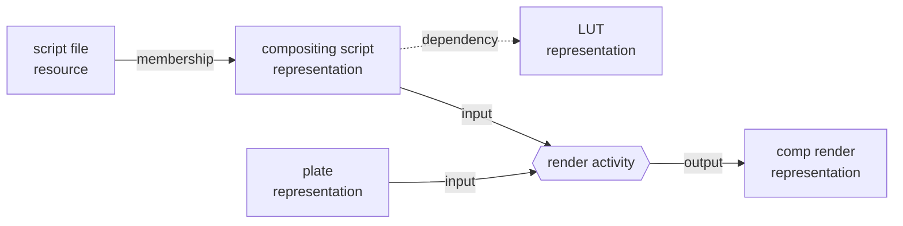

# Dependency relationships

A dependency is a live reference from one representation to another production
object. Examples include a USD layer referencing a character layer, a Nuke
script reading a plate, or an OCIO configuration naming a LUT. The target is
consulted whenever the source is opened or used.

Dependencies are distinct from two existing relationships:

| Relationship | Meaning | Effect of a target change |
|---|---|---|
| Membership | Resources constitute a representation | The representation changed |
| Provenance | An activity used inputs to produce outputs | Generated outputs may be stale |
| Dependency | A representation needs a live target | The source sees the target's current content |

A changed dependency therefore does not make the referencing representation
stale. It can make an artifact produced *from* that representation stale,
because the activity used a previous state of the dependency closure.

In the following example, a compositing script is one input of a render, and
the script reads a LUT at render time:



A new LUT does not make the script stale; the script still reads whichever LUT
is current. It makes the comp render stale, because the render activity
captured the LUT that the script read when the render was made.

## Edge model

Every edge records:

- the source representation and, optionally, the source resource containing
  the reference;
- an open-world namespaced kind such as `org.openusd:reference`;
- either a floating asset target or a pinned representation target;
- the representation selected for a floating target, when the caller resolved
  one;
- whether the dependency is required; and
- the authored reference exactly as supplied, without normalization.

Edges have no separate durable IDs. Their order within the source's complete
recorded set distinguishes repeated occurrences.

PostProject does not inspect files or resolve authored paths. A host or adapter
supplies the dependency set and any resolved representation. Unknown valid
kinds and authored reference text round-trip unchanged.

## Complete observations

Dependencies are observations of source content rather than individually
editable rows. Recording replaces the complete ordered set atomically. An
identical current set is a no-op; a different set creates one semantic revision
event. An explicitly recorded empty set means the source was inspected and has
no dependencies. This is different from an absent set, which means dependency
knowledge has never been recorded.

Recording a new fingerprint for the source representation marks its existing
dependency set as `needs_extraction`. A caller must extract and record a new
complete set before it is current again. Storage never reads source files on
the caller's behalf.

Cycles are permitted. Dependency graphs can reflect composition systems whose
relationships are not acyclic, so traversal must always use explicit bounds.

## Artifact evaluation

When an activity is recorded, storage captures the required dependency closure
of each input alongside its direct fingerprint snapshot. Captured evidence
includes the typed path and the representation chosen for each floating asset
target.

Artifact evaluation reports:

- **stale** when a captured required path changes or a dependency's comparable
  fingerprint changes;
- **indeterminate** when dependency knowledge is absent, needs extraction,
  cannot resolve a floating target, lacks comparable fingerprint evidence, or
  exceeds a traversal bound; and
- **current** only when the required captured closure remains comparable and
  unchanged.

Reasons contain the exact dependency path so an application can explain which
authored reference led to the result. Optional dependencies remain queryable
but are excluded from activity snapshot closure.

## Public operations

Rust exposes complete-set recording through `ProductionStoreTransaction` and
bounded forward/reverse queries through `ProductionRead`. A query supplies a
depth from 1 through 64, a visited-representation bound from 1 through 1,000,
and a page size from 1 through 1,000. Depth one is a direct query. Results are
ordered by stable target identity, include the shortest observed depth, and
exclude a cycle back to the query root. `traversal_truncated` is independent of
`next_cursor`: the former means graph bounds hid part of the closure, while the
latter means more results remain in the bounded closure.

Continuation cursors are opaque and bound to the query root and all traversal
parameters. Reusing one with different parameters is an invalid argument.
Pages are weakly consistent across commits; use the revision feed when a caller
needs change tracking rather than a snapshot scan.

The C ABI uses owned dependency observation and query-page handles; strings and
cursors borrow their owning handle until release. The C++ and Python wrappers
copy those values into native immutable objects.

The CLI accepts an ordered JSON array with `dependency record`, distinguishes
absent and empty observations with `dependency show`, and exposes
`dependency dependencies` and `dependency dependents` with `--max-depth`,
`--max-representations`, `--limit`, and `--cursor`. JSON queries return
`items`, `next_cursor`, and `traversal_truncated`. All recording remains
explicit and transactional.

## Across public surfaces

The example records a complete dependency observation, then performs bounded
forward and reverse queries:

```{code-variants} dependency-queries
```

A new fingerprint observation of the source marks its recorded set as needing
extraction until a fresh complete set is recorded:

```{code-variants} dependency-set
```

See [bounded queries and cursors](../integrators/bounded-queries.md) for cursor
ownership, pagination, and weak-consistency guidance.

See [artifact knowledge and reproducibility](artifact-knowledge.md) for the
derived state model and [production provenance](provenance.md) for completed
transformations. The standards mappings and deliberate non-mappings are in the
[standards matrix](../reference/standards-mapping-matrix.md).
