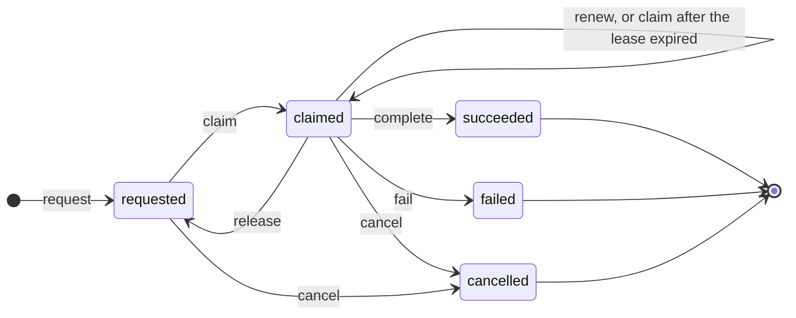

# Jobs and production work

A job is durable production knowledge that work is wanted, in progress, or did
not succeed. It is not a scheduler task and it is not provenance. Applications,
scripts, and render services can all act as workers while keeping their own
queues and process-management policies.

Every job records:

- an open-world, namespaced kind such as `org.postproject:generate-proxy`;
- the input representations;
- typed parameter metadata targeting the job;
- the requested output asset, representation kind, and optional media root;
  and
- its current lifecycle state.

Unknown valid job kinds and metadata vocabularies round-trip unchanged.

## Lifecycle



An expired lease leaves the stored state claimed, but its worker can no longer
renew, release, complete or fail it. Another worker can acquire a new lease.

A claim records descriptive tool and optional agent identity and an expiry.
The worker owns a production-bound lease; its private credential fences earlier
workers. Ordinary job facts and events do not reveal that credential.

Claim and renewal accept positive whole-microsecond durations up to 24 hours.
Storage samples its own clock and checks the lease again before commit. Its
durable clock high-water mark rejects guarded operations after a backward clock
jump until time catches up. A forward jump can expire a lease immediately.
This coordinates local workers; it is not authentication or trusted time.

Each transition is a semantic revision event. Claim tokens are deliberately
absent from events: an event tells a reader to reload the job, but does not
publish the capability needed to change it.

## Completion and failure

A successful worker stages the output representation and resources, a complete
provenance activity, and the job completion in one transaction. Storage
captures the activity's input and output snapshots during that commit. Either
the output, activity, snapshots, and `succeeded` state all become durable, or
none of them do.

Failure records a bounded diagnostic and no activity or representation.
Activities remain facts about completed operations; pending and failed work is
represented only by jobs.

## Regeneration plans

For an existing artifact with exactly one producing activity, regeneration
planning derives a new requested job from that activity's inputs and typed
parameter metadata. When the activity completed a job, the plan repeats that
job's kind and target media root; otherwise it uses the activity's kind and no
target root. The proposed output targets the existing artifact's asset and
representation kind.

Planning is read-only. It deduplicates repeated artifact IDs, does not persist
the proposed jobs, does not advance the revision feed, and never runs a tool.
The caller chooses whether to enqueue a proposal in an explicit transaction.

Artifact knowledge, availability, and work remain independent dimensions. A
stale proxy can be online with no pending job; a requested job does not make an
artifact stale.

## Across public surfaces

The example requests work, filters by exact state and kind, and follows opaque
one-item pages to completion:

```{code-variants} job-query-pages
```

A worker claims a job, stages the output and its activity, and completes the job
so that all three become durable together:

```{code-variants} complete-job
```

See [bounded queries and cursors](../integrators/bounded-queries.md) for
continuation rules.

See [artifact knowledge and reproducibility](artifact-knowledge.md) for the
derived knowledge state and [jobs and workers](../integrators/jobs-and-workers.md)
for the worker protocol. The [reference local executor](../integrators/reference-executor.md)
is one optional worker; jobs do not depend on it and are never run implicitly.
