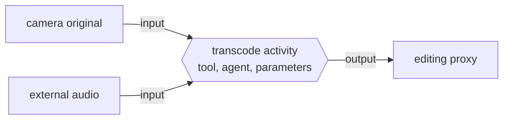

# Production provenance

Provenance records how a representation was produced. PostProject stores the
operation as an activity between its inputs and outputs:



This keeps the operation itself available. A consumer can inspect the kind of
work, optional input/output roles, timestamps, tool and version, responsible
agent, and metadata parameters instead of seeing only an unexplained
`derived-from` link.

Activity kinds and edge roles are namespaced strings. Applications and studios
can add their own vocabulary without waiting for a closed PostProject enum.
Unknown valid identifiers remain ordinary provenance data.

When an activity commits, storage captures the current representation
fingerprints on every input and output edge. Those snapshots let callers
evaluate [artifact knowledge and reproducibility](artifact-knowledge.md)
without reading media files.

## Graph behavior

Activities support fan-in, fan-out, and processing across assets. An activity
may have no inputs—for example, capture or generation—but a completed activity
must have at least one output. The same representation cannot be both an input
and output of one activity, and a new activity cannot introduce a generation
cycle.

Ancestry and descendants are derived by traversing activities. PostProject does
not infer that an output is a revision, variant, alternative, or proxy unless a
consumer records that separate semantic fact.

## Scope and trust

Activity provenance is portable production knowledge, not proof of authenticity
and not a job-execution system. Parameters are typed metadata assertions on the
activity. Cryptographic claims and verification remain the responsibility of a
trust layer such as C2PA, and actually running a transcode or render remains the
responsibility of the host application or workflow system.

See [standards boundaries](standards-boundaries.md) for the conceptual mapping
to W3C PROV and MovieLabs OMC.

## Across public surfaces

The example records one activity and queries the graph from its input and
output sides:

```{code-variants} provenance
```

Storage snapshots each input's and output's fingerprints when the activity is
recorded; reading an activity returns those snapshots with its tool and agent
attribution:

```{code-variants} activity-snapshots
```
