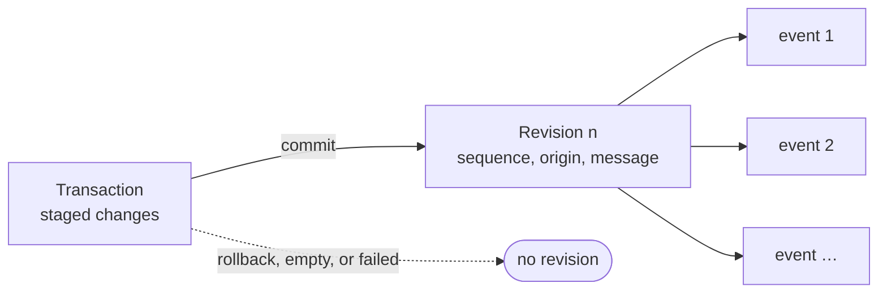

# Revisions and semantic events

A revision is the durable record of one successful mutating transaction. It
gives another application a production-local cursor for discovering changes
without repeatedly scanning the whole production.

Every non-empty committed transaction creates exactly one revision. The domain
changes, revision, and ordered semantic events are atomic: consumers see all of
them or none of them. Empty transactions, rollbacks, and failed mutations do
not advance the revision sequence.



## Revision identity and origin

A revision contains:

- a stable `RevisionId`;
- a positive, monotonically increasing production-local sequence;
- the `TransactionId` that produced it;
- a commit timestamp;
- an optional integrating application/process identity; and
- an optional bounded human-facing message.

The origin describes software such as an editor, ingest service, or automation
worker. It is not an authenticated user identity, authorship proof, or access
control decision.

## Event catalog

Events say which semantic fact changed and provide enough identity for a
consumer to re-query current state.

| Event | Meaning |
| --- | --- |
| `AssetImported` | A logical asset import aggregate was created. |
| `RepresentationAdded` | A representation was attached to an asset. |
| `ResourceAdded` | A storage resource was created. |
| `RepresentationResourceAdded` | A resource entered a representation structure. |
| `LocatorAdded` | A resource locator was added or explicitly confirmed. |
| `LocatorRetired` | A superseded resource locator was removed. |
| `MediaRootAdded` | A resolver search root was added. |
| `MediaRootEnabledChanged` | A resolver search root was enabled or disabled. |
| `MediaRootRemoved` | A resolver search root was removed. |
| `ExternalIdentifierAdded` | An exact identifier attachment was added. |
| `ExternalIdentifierRemoved` | An exact identifier attachment was removed. |
| `MetadataAddedOrReplaced` | Values for one metadata property changed. |
| `MetadataRemoved` | One metadata property was removed. |
| `ActivityCreated` | A production activity was recorded. |
| `ActivityInputAdded` | A consumed-representation edge was recorded. |
| `ActivityOutputAdded` | A produced-representation edge was recorded. |
| `ResourceFingerprintObserved` | A resource fingerprint domain received a new current observation. |
| `ResourceFileFactsObserved` | A resource's recorded size or modification time changed. |
| `RepresentationFingerprintObserved` | A representation fingerprint domain received a new current observation. |
| `DependencySetRecorded` | A representation's complete dependency observation was replaced. |
| `JobRequested` | A durable work request was created. |
| `JobClaimed` | A worker claimed requested or expired work. |
| `JobClaimRenewed` | The current worker extended its lease. |
| `JobClaimReleased` | The current worker returned work to requested state. |
| `JobSucceeded` | Output and provenance committed atomically with completion. |
| `JobFailed` | Work failed with no output representation or activity. |
| `JobCancelled` | Requested or claimed work was cancelled. |

The catalog is semantic, not a stream of SQL row operations or serialized Rust
objects. Multiple events in one revision preserve their stable transaction
order.

Job events carry only the job ID. Consumers reload the job for current state;
the claim token is never published in the journal.

## Pull model

Consumers poll with three operations:

- `latest_revision` discovers the current cursor;
- `changes_since(sequence, limit)` reads a bounded ascending page; and
- `events_for_revision(revision_id)` reads that revision's ordered events.

Two further operations build on the same cursor:

- `changes_since_filtered(sequence, event types, limit)` returns only the
  revisions that contain at least one event of the requested types, together
  with a *through sequence*. Every matching revision up to that sequence is in
  the page, so the through sequence is the next cursor and unrelated revisions
  are skipped without being read.
- A *revision waiter* blocks for a bounded time until a revision after a
  sequence exists. It observes commits made through the same production at
  once and commits by other processes sharing the production file within a
  short polling interval. There is no daemon and no callback from the library;
  the C++ and Python observers run the wait on a thread they own.

After receiving an event, a consumer should re-query the relevant object when
it needs current values. Events are an observation and cache-invalidation
mechanism, not a replay log that replaces the production database.

## Deliberate boundaries

The journal is not undo/redo. It does not store inverse operations.

The journal is not itself multi-user collaboration. Local transactions may use
a base revision for {doc}`semantic optimistic conflicts
<../integrators/semantic-conflicts>`, but the journal has no distributed merge,
authenticated authorship, network subscription transport, or remote ordering.
Waiting and shared writes are local to processes that can open the same
production file.

## Across public surfaces

The example drains bounded revision pages and advances the durable consumer
cursor only after processing every event in a revision:

```{code-variants} revision-feed
```
