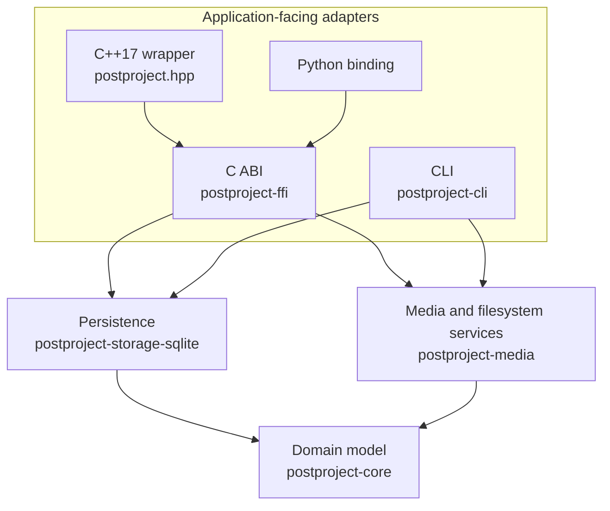

# Contributor guide

This guide explains how to change PostProject without accidentally moving responsibilities between layers or changing persistent meaning in only one public surface.

If you are integrating PostProject into another application, use {doc}`../integrators/README` instead. This page is about changing PostProject itself.

## Before changing code

First decide what kind of change you are making:

- **Domain semantics** — changes what a production object means.
- **Persistence** — changes how durable knowledge is stored or migrated.
- **Media/filesystem behavior** — changes inspection, recognition, discovery, or resolution.
- **Public API/ABI** — changes what C, C++, Python, CLI, or installed consumers can observe.
- **Documentation/examples** — changes how behavior is taught or demonstrated.

A feature that crosses these categories usually needs coordinated updates rather than a patch in one crate.

## Layer responsibilities

The project is intentionally layered:



Arrows point from a component to what it depends on. The C ABI and the CLI
also use the domain model directly; nothing depends on an adapter, and the
domain model depends on no other component.

The domain layer should remain framework-neutral. SQLite implements persistence contracts rather than defining the domain. Filesystem/media services discover and inspect external state; they do not become the source of logical identity. Public adapters translate those semantics without leaking Rust layouts or backend handles across the ABI.

## Changes that require wider review

Treat changes to any of the following as architectural rather than local implementation detail:

- durable object identity;
- asset/representation/resource/content-structure meaning;
- metadata or provenance semantics;
- dependency or artifact-state semantics;
- revision event meaning;
- schema and migrations;
- public C ABI or ownership rules;
- compatibility guarantees;
- standards boundaries.

For those changes, update the relevant ADR or add a new one when the decision is materially new. Also update standards-impact documentation when an external mapping or boundary is affected.

## Keep public surfaces aligned

A semantic feature is not complete when it exists in only one language binding unless that limitation is intentional and documented.

Where applicable, coordinate:

- domain operations;
- SQLite persistence and migration fixtures;
- C ABI;
- C++ wrapper;
- Python binding;
- CLI behavior;
- compiled/tested examples;
- concept and integrator documentation;
- tests, fuzz targets, and changelog/release notes.

The C ABI is the native interoperability boundary. Do not expose Rust memory layouts, Rust enums, or storage-backend handles through it.

## Tests are part of the contract

Prefer tests that validate behavior at the boundary where a regression would matter:

- domain tests for semantic invariants;
- persistence tests for round trips and migrations;
- integration tests for installed C/C++/Python consumers;
- fixture tests for compound media and relinking;
- fuzzing for parsers and public input boundaries where appropriate;
- release acceptance tests for the supported package surface.

When changing durable data, add or update migration fixtures instead of testing only freshly created databases.

## Documentation rule: teach before you reference

New user-facing behavior should normally have three levels of documentation:

1. a short explanation of the problem and expected behavior;
2. an integrator workflow or tested example;
3. exact API reference.

Do not make readers infer the product model from function signatures or ADRs.

Existing `{code-variants}` blocks are generated from compiled/tested example programs and should be preserved when rewriting prose around them.

A new public operation needs an example on every surface that offers it. Add a region to the fitting topic program under `docs/examples/<surface>/`, show it with `{code-variants}`, and explain any surface that lacks the operation with `no-variant`. `tools/check_example_coverage.py` fails CI when a C function, C++ member function, or Python method has no example.

## Model-specific contributor references

Read these before changing the relevant subsystem:

- {doc}`content-structure-invariants`
- {doc}`metadata-model`
- {doc}`provenance-model`
- {doc}`standards-policy`

For repository-wide engineering detail, continue with {doc}`../project/README`.
The development {doc}`API safety audit </api-safety-audit>` and
{doc}`repository migration inventory </api-safety-repositories>` record the
current cross-surface work and verification gaps.

```{toctree}
:hidden:

content-structure-invariants
metadata-model
provenance-model
standards-policy
/api-safety-audit
/api-safety-repositories
```
