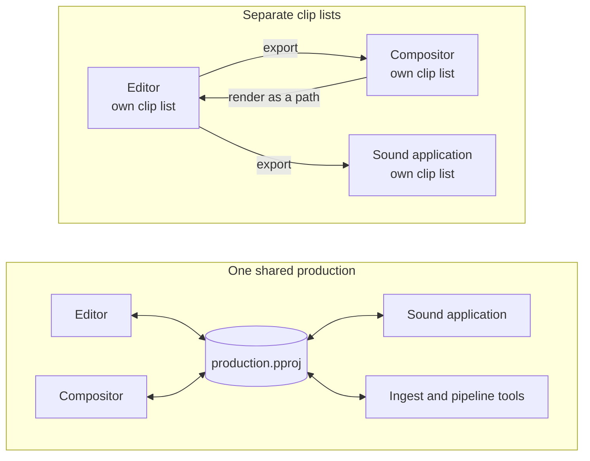
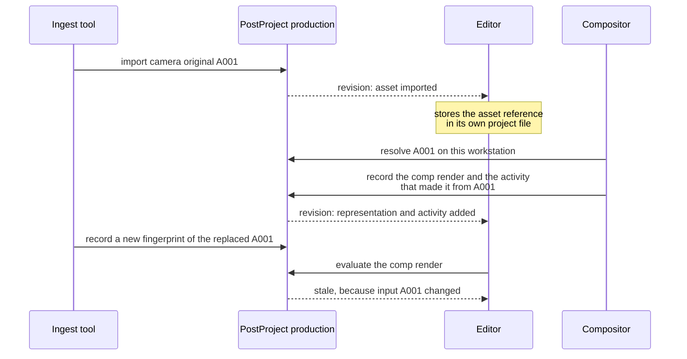
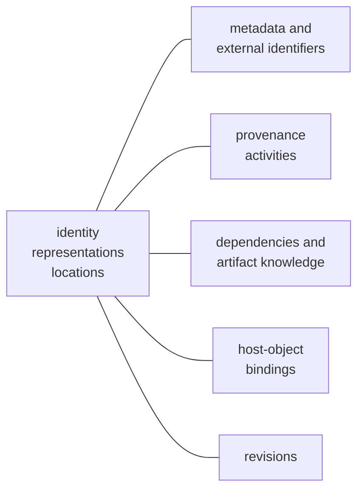

# Start here

PostProject exists because media applications often know the same facts separately.

An editor may know that a clip is `A001_C003`. A compositor may know a plate sequence derived from it. A sound tool may refer to synchronized production audio. A pipeline script may know where the original card copy lives. If every tool stores those facts only in its own project format, moving between applications loses context and makes relinking, provenance, and automation harder than they need to be.

PostProject gives applications a place to share the **media knowledge that belongs to the production rather than to one application**.

## What stays in the application

PostProject does not try to absorb application-specific creative state. An editor still owns its timeline and edits. A compositor owns its node graph. A sound application owns its session. Those project files can refer to PostProject identities when they need a durable reference to shared media.

## What goes into PostProject

A PostProject production can remember:

- that two applications are talking about the same logical asset;
- that an asset has an original, proxy, optimized version, or derived representation;
- that a representation consists of one file, an image sequence, ordered parts, or a package;
- where those resources are currently reachable;
- how to find them again after storage moves;
- external identifiers and typed metadata;
- which activity produced an output from which inputs;
- dependencies and knowledge about whether a managed artifact is current;
- semantic changes that other applications can consume.

The production database is therefore closer to **shared production memory** than to a folder catalog.

## Why several applications gain from sharing one production

Without shared knowledge, every application keeps its own list of clips. Each
hand-off is an export that the next application has to re-import and relink,
and each application relinks moved media on its own. With PostProject, every
application reads and writes the same production, while its own project file
stores only references to it:



The benefit grows with every application that takes part:

- **Import once.** Media ingested by one tool has the same identity in every
  other tool; no application invents its own duplicate clip.
- **Relink once.** A location confirmed by one application after storage moved
  is a locator every other application resolves too.
- **Results arrive as the same media.** A proxy, render, or graded version made
  by one application is a representation or recorded output that the others
  can find, not an unrelated file.
- **History crosses tool boundaries.** Provenance recorded by the compositor
  explains to the editor where a shot came from and whether it is still
  current.
- **Changes are visible.** Every commit is a revision, so one application can
  react to what another did without rereading the whole production.
- **Work can be handed off.** One application requests a job, another claims
  and completes it.

For example, a shot passes through three applications that share one
production:



None of the three applications had to export, re-import, or relink anything,
and each one kept its own project format.

## The most important distinction: identity is not location

Consider a camera original that starts here:

```text
/Volumes/RAID/Documentary/CameraA/A001.mov
```

Later, the same media may live here:

```text
/mnt/archive/documentary/originals/A001.mov
```

An application should not have to decide that this is a new clip simply because the path changed. PostProject gives the media a durable identity and treats paths as location information that can change over time.

This is the foundation for portable productions and deterministic relinking.

## Four objects explain most of the model


- An **asset** is the logical media item.
- A **representation** is a usable form of that asset, such as an original or proxy.
- A **resource** is one stored component of a representation.
- A **locator** says where a resource can be reached.

An image sequence is not thousands of unrelated assets. It can be one representation with compact sequence structure. A camera package can likewise remain one meaningful representation even when it spans many files.

Read {doc}`core-model` for the model in more detail.

## Production knowledge grows from that core

Once identity and representation are stable, other knowledge can attach to them:



This is why PostProject separates the concepts instead of treating a media item as a row containing a path and some tags.

## What happens when information is uncertain

PostProject favors explicit uncertainty over convenient guessing.

If moved media can be resolved to one well-supported candidate, applications can use that result. If multiple candidates remain plausible, the ambiguity is represented rather than silently picking a file. The same principle appears elsewhere in the model: missing fingerprint evidence, incomplete dependency knowledge, and partial availability are not collapsed into false certainty.

## Pick the next guide by what you are doing

- **Using the CLI or a PostProject-enabled application:** {doc}`../users/README`
- **Trying a portable production workflow:** {doc}`../users/portable-production-workflow`
- **Adding PostProject to an application:** {doc}`../integrators/README`
- **Looking up exact semantics:** {doc}`../concepts/README`
- **Contributing to the implementation:** {doc}`../contributors/README`

If you only remember one sentence, use this one:

> PostProject gives different post-production tools a shared, durable description of media without trying to replace those tools.
