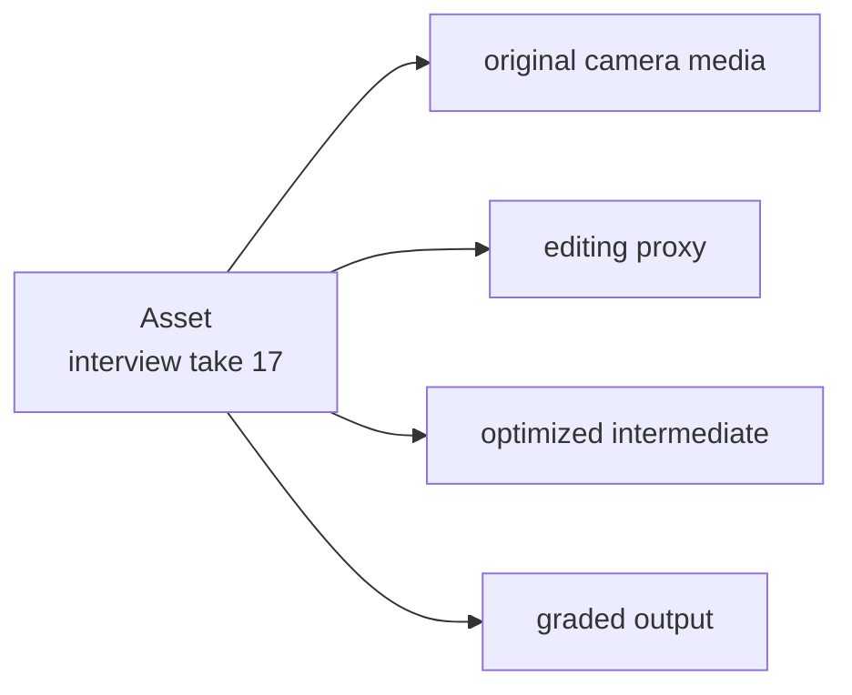
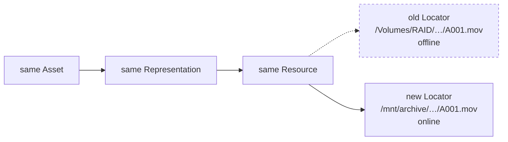
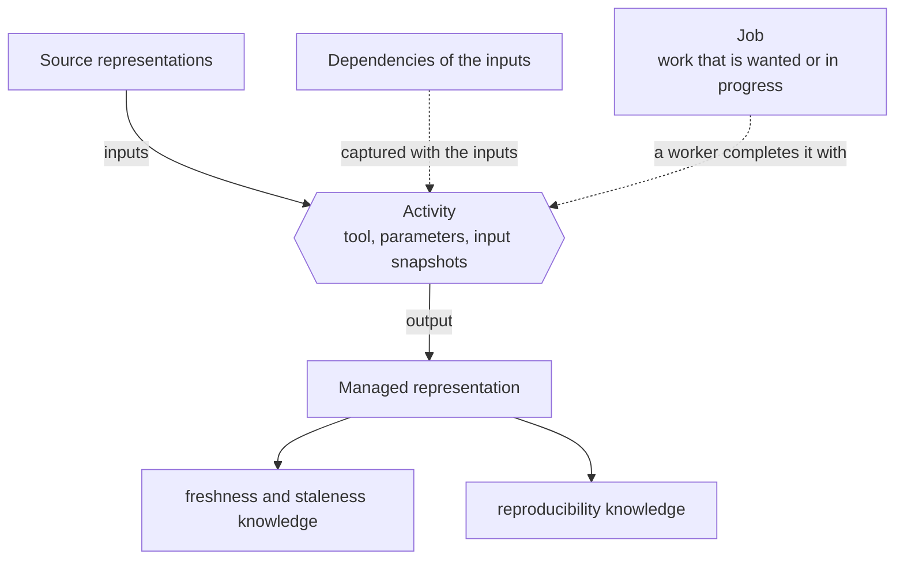

# The core model

Most PostProject workflows become easier to understand once four concepts are kept separate: **asset, representation, resource, and locator**.

## Asset: what is this media?

An asset is the logical thing applications intend to refer to. It is not a filename and not a row copied from a filesystem scan.

Examples include a camera clip, a still, a sound recording, or another logical media item whose identity should survive storage changes.

An asset receives a PostProject identity that is meaningful inside the production model. Industry or application identifiers such as UMIDs, EIDR values, camera IDs, or host-application IDs remain separate external identifiers; PostProject does not pretend its internal UUID is one of those standards.

## Representation: which usable form?

A representation is one concrete realization of the asset.

For one asset, a production might know about:

Representations make it possible to say “these files are different forms of the same logical media” without flattening them into one path.

A representation can also describe compound media. The important point is that **one representation does not necessarily equal one file**.

## Resource: what stored pieces make up the representation?

A resource is a stored component of a representation.

Depending on the content structure, a representation may have:

- one resource;
- a compactly described image sequence;
- ordered parts or spans;
- package contents.

That distinction matters for VFX sequences and camera formats. Applications can reason about “the representation” as one thing while still knowing the pieces required to make it complete.

## Locator: where can a resource be reached?

A locator describes a place where a resource can be reached. A resource may have multiple known locators over its lifetime.

Moving media therefore changes location knowledge rather than identity:

Portable media roots add another useful level. Instead of baking one machine's absolute path into production meaning, a production can name a logical storage root and let each environment map that root locally.

## Why fingerprints are separate from identity

Fingerprints are evidence about stored content. They help confirm that a candidate resource is the one PostProject expected to find.

They are useful for verification and relinking, but a fingerprint is still not the identity of the logical asset. Keeping the two separate lets the system express facts such as:

- this is the same logical resource at a new path;
- this file has changed since an earlier observation;
- several candidates look plausible and require a decision;
- a representation is currently only partially available.

## Metadata and provenance attach to objects, not filenames

Once objects have durable identity, knowledge can attach to the object it actually describes.

Metadata can use explicit vocabulary namespaces and typed values. External identifiers can preserve a scheme/value pair. Provenance uses activities with inputs and outputs rather than inferring history from filenames.

This keeps the model useful when a representation moves or when more than one representation exists.

## Revisions describe semantic changes

Applications often need to know what changed without rereading an entire production. PostProject records semantic revisions and events for that purpose.

A consumer advances its cursor only after it has completely processed a revision. The revision feed is about changes to production knowledge; it is not a filesystem notification system.

## Where artifact knowledge and jobs fit

Managed artifacts and jobs build on the same foundation:

A job records durable production knowledge that work is wanted or in progress. A worker or host application decides how work is scheduled and executed. This preserves a useful boundary: **PostProject can know about work without becoming the scheduler or media-processing engine.**

## Continue from here

For practical behavior, read {doc}`../users/portable-production-workflow`. For exact definitions and edge cases, use the individual pages under {doc}`../concepts/README`.
