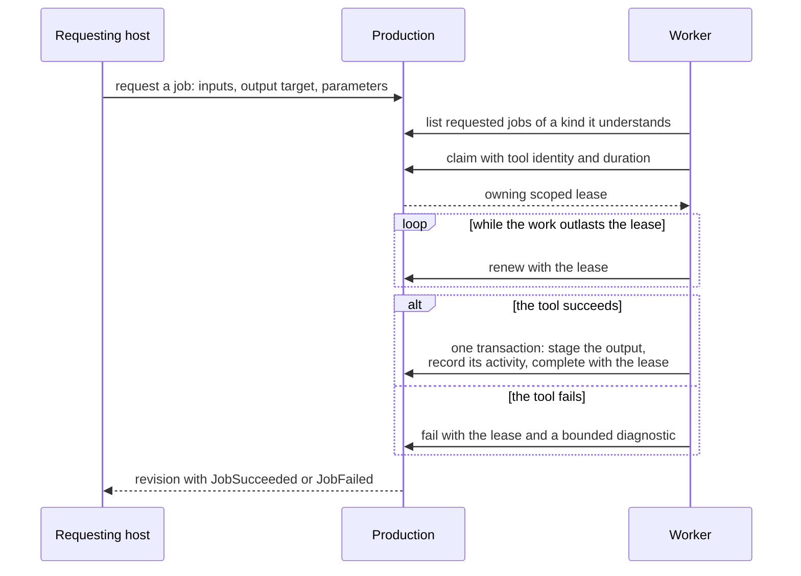

# Jobs and workers

PostProject persists the production meaning of requested work. Your host,
service, or script remains responsible for choosing jobs, starting processes,
managing resources, and applying retry policy.

The protocol between a host that wants work and a worker that does it:



Each arrow into the production is a committed transaction; the sections below
describe them in order.

## Request work

Create the job and any parameter metadata in one transaction. The request names
its input representations and the desired output asset and representation kind,
optionally with a logical target root for the output. Parameters use the normal
typed metadata model with the job as their target:

```{code-variants} request-job
```

The kind names the work, and any worker that understands a kind may claim a job
of it, including `postproject job run` for the reference executor's kinds.
Parameters that only your application can interpret, such as its own encoder
settings, need a kind of your own, qualified by your application's identifier.
Planned regeneration copies the kind from the producing activity, so a plan
derived from your activity is claimed by your workers only. A host that is the
only worker for its jobs can request and claim a job in one transaction, so no
other worker sees it requested.

Listing jobs returns a bounded page in stable identity order. State and
open-world kind are optional exact filters. Pass the opaque `next_cursor` back
with the same filters and page size to continue; pages are weakly consistent
across commits:

```{code-variants} job-query-pages
```

Job results have one applicable state payload. C++ uses `Job.status`, a standard
variant; Python has an immutable status alternative and derived inspection
properties. C's checked claim, completion and failure accessors reject the
wrong state and clear their outputs on failure. Strings borrow the job set:

```{code-variants} inspect-job-status
:::{no-variant} rust
Match the existing `JobState` enum and its payload.
:::
:::{no-variant} cpp
Inspect `Job.status` with `std::get_if` or `std::visit`.
:::
:::{no-variant} python
Inspect `Job.status` or the derived `claim`, `completion` and diagnostic properties.
:::
:::{no-variant} cli
Inspect the job's state and applicable detail in JSON output.
:::
```

## Claim, renew, and release

A worker claims a requested job with tool attribution, optional agent attribution,
and a duration. The returned owning lease is pending until its transaction
commits. Claiming and completing within that same transaction is supported.
Claim before staging the output when using native bindings.

Renew before expiry, giving a duration that extends the current expiry. Release
returns the job to requested state without recording failure:

```{code-variants} claim-job
```

Every worker transition checks production, job, current credential and expiry
under the writer lock, including a final expiry check before commit. Failed
commits close newly pending leases and roll back publication. Dropping a lease
only frees local resources; it never releases or renews a job. Coordinator
cancellation invalidates an active lease immediately.

Use Rust `Duration`, integral C++ `std::chrono::duration`, Python `timedelta`, or
C's explicitly named microsecond scalar. Durations must be positive exact whole
microseconds, at most 24 hours. Caller-selected current times are not accepted.
Storage preserves a clock high-water mark across reopen; backward jumps reject
guarded transitions until time catches up, and forward jumps may expire work.

Export a token explicitly to pass a lease between processes. Import validates
its version, size, production, job and current authority state. Tokens grant
local worker authority and must stay private; they do not authenticate a user.
The CLI creates a new `--lease-token-file FILE` for a claim and reads that file
for later transitions. Use `--lease-token-file -` to read a token from stdin.
Existing output files are never overwritten. New Unix files have mode `0600`;
Windows files inherit the directory's ACL. Choose a private directory.

CLI `--lease` values are an integer followed by `us`, `ms`, `s`, `m` or `h`, with
`60s` as the default. Claim reserves the output file before writing production
state. If delivery fails after commit, the error retains the committed receipt;
the claim remains durable until expiry or cancellation. An incomplete owned file
is removed. Listings, JSON results, events and diagnostics never print tokens.

## Complete a job

On success, stage the output representation and the activity that produced it,
then complete the job in that same transaction. The output, the activity with
its input snapshots, and the job's transition to succeeded become durable
together or not at all:

```{code-variants} complete-job
```

Completion validates that the activity consumes the job inputs and produces
the staged output requested by the job. It does not copy the job's parameters:
record on the activity the parameters the worker actually used, so the output
can be reproduced and a regeneration plan carries them. Do not commit the representation or
activity in an earlier transaction: only `complete` gives the all-or-nothing
guarantee. Library callers can stage any representation structure — single
resource, image sequence, ordered parts, or package — before completing; the
CLI completion adapter creates a single-file output.

Staging an output representation fingerprints its files, so a new output needs
no separate fingerprint step. A worker that instead rewrites existing media in
place must observe that content in the transaction:

- a proxy regenerated at its old path;
- a source replaced by a conform.

See [recording a new fingerprint observation](fingerprints-and-verification.md#record-a-new-fingerprint-observation).
Observation records the new resource value and recomputes every representation
that uses the resource, so [artifact evaluation](artifacts-and-staleness.md)
reports the artifacts that depend on it as stale. Never write a representation
fingerprint of your own devising. Only PostProject's own values take part in
staleness and resolution.

Some work happens before there is a production to record it in, for example
proxies an editor renders before a project is first saved. Record such work
later only when your application has its own evidence of what it was made
from, and record its activity without a job, tool, or parameters you did not
observe. Artifact evaluation can still report the output as current, and the
reproducibility report says, correctly, that it cannot be regenerated.

## Fail or cancel a job

On a tool error, fail the job with a bounded diagnostic. A failed job never
leaves a representation or activity behind:

```{code-variants} fail-job
```

Cancelling is administrative and needs no claim token. It is permitted while
the job is requested or claimed:

```{code-variants} cancel-job
```

## Learn when work finishes

A requester does not need to poll the job list. Every job transition is a
semantic revision event, so wait on a [revision waiter](revision-feed.md) and
fetch the revisions filtered to `JobSucceeded`, `JobFailed`, and `JobCancelled`
events after your cursor. This observes a worker in another process — for
example `postproject job run` — as soon as it commits.

## Public operations

| Operation | Rust | C | C++ | Python | CLI |
|---|---|---|---|---|---|
| request | `request_job` | `pp_transaction_request_job` | `requestJob` | `request_job` | `job request` |
| list | `jobs` | `pp_production_jobs` | `jobs` | `jobs` | `job list` |
| read one | `job` | `pp_production_job` | `job` | `job` | `job show` |
| claim | `claim_job_lease` | `pp_transaction_claim_job_lease` | `claimJobLease` | `claim_job_lease` | `job claim` |
| renew | `renew_job_lease` | `pp_transaction_renew_job_lease` | `renewJobLease` | `renew_job_lease` | `job renew` |
| release | `release_job_lease` | `pp_transaction_release_job_lease` | `releaseJobLease` | `release_job_lease` | `job release` |
| complete | `complete_job_lease` | `pp_transaction_complete_job_lease` | `completeJobLease` | `complete_job_lease` | `job complete` |
| fail | `fail_job_lease` | `pp_transaction_fail_job_lease` | `failJobLease` | `fail_job_lease` | `job fail` |
| cancel | `cancel_job` | `pp_transaction_cancel_job` | `cancelJob` | `cancel_job` | `job cancel` |
| plan regeneration | `plan_regeneration` | `pp_production_plan_regeneration` | `planRegeneration` | `plan_regeneration` | `job plan` |

The C ABI returns owned job and regeneration-plan sets; reading one job returns
a one-element job set. A job page's optional
cursor borrows the job set and must be copied before release. Release every
returned set with its matching release function. The C++ and Python bindings
copy result values and cursors into their native immutable types. The CLI
accepts `job list --state`, `--kind`, `--limit`, and `--cursor`; JSON output is
a page object with `items` and `next_cursor`.

The opt-in [reference local executor](reference-executor.md) builds on this
protocol for proxy and thumbnail jobs. Its subprocess adapter is available in
Rust and its complete runner is available as `job run`; C, C++, and Python
workers use the protocol above rather than an executor wrapper.

## Plan and explicitly enqueue regeneration

`plan_regeneration` accepts artifact representation IDs and returns proposals
derived from recorded producers. Each proposal includes a fresh requested job
and parameter metadata already retargeted to that job ID. The inputs and
parameters come from the producing activity. When that activity completed a
job, the proposal repeats the job's kind and target root, so the work reaches
the same workers and destination. Planning requires one unambiguous producer for
each artifact (ADR 0023).

The proposal is not durable. To enqueue it, open a transaction, request the
proposed job, copy its parameter assertions to the job target, and commit. This
separation lets a host review, prioritize, modify, or discard proposed work and
prevents a read from creating background work.

```{code-variants} plan-regeneration
```

See [jobs and production work](../concepts/jobs.md) for the domain model and
[revision feed](revision-feed.md) for cross-process change discovery.
