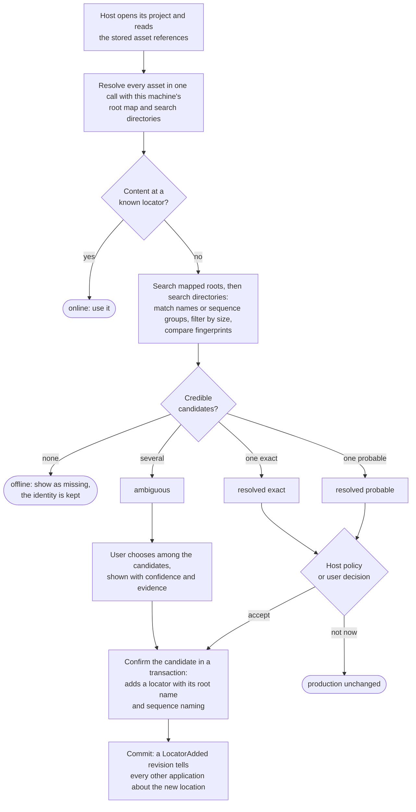

# Media roots and resolution

Media moves: a production is copied to another workstation, a volume is
mounted at a different path, or a folder is reorganized. PostProject keeps
asset and representation identity stable while storage locations change, and
resolution answers where the content can be reached *now*.

## The relinking flow

A host usually relinks when it opens a project whose media has moved. The
sections below explain each step; the flow as a whole is:



Resolution itself never changes the production. Only the confirmation step
writes, and never on its own for an ambiguous result.

## Register a logical media root

A media root is a portable, production-wide name such as `rushes`. It does not
store a machine path. Each machine supplies the local directory for a root name
at resolution time, so the same production resolves correctly on differently
mounted systems.

```{code-variants} media-root
```

Roots have an optional label and a priority; lower priorities are searched
first.

## Disable, enable, and remove roots

A disabled root stays in the production but is skipped during resolution,
which is useful while a volume is known to be offline. Removing a root deletes
the name; locators already confirmed under it keep their recorded root name as
history. Each change is a revision like any other:

```{code-variants} media-root-lifecycle
```

Root creation is additive. Enabling or removing an existing root requires an
edit tied to a read session; CLI commands take its `inspect` decision token.

## Resolve an asset

Resolution checks the known locators of every resource and, where content is
missing, searches the mapped roots for credible candidates. It reports one
aggregate availability per representation (online, partial, offline,
ambiguous, or error), the state of each resource, scored candidates with their
evidence, and availability issues such as missing sequence frames.

The example maps the `rushes` root to this machine's directory after the
imported file has been moved there:

```{code-variants} resolve-asset
```

Resolution is read-only. It never changes locators, even when exactly one
candidate matches exactly. An unmapped root is reported as unmapped evidence
rather than an error, and an unreadable mapping as unavailable; other roots are
still searched.

## Confirm a candidate

Only an explicit confirmation makes a candidate durable. The integration
decides which candidate to confirm: a person picks one of several plausible
candidates, or a policy accepts a single exact match. Confirmation adds a
locator for the resource in a transaction; the stored identity is unchanged.

A candidate found under a mapped root names that logical root. The example
confirms such a candidate under that root, so the locator records the portable
root name but never the local directory. The CLI `media resolve --confirm` does the same automatically. A candidate for
an image sequence also carries the naming of its files, and confirmation must
record it.
[Locator and media-root queries](bounded-queries.md) report that recorded root.

```{code-variants} confirm-locator
```

Never confirm one of several candidates automatically. Present them, with
their confidence and evidence, and let the user choose.

A candidate with `fingerprint_not_verified` evidence was matched by name and
size only. The resource's recorded fingerprints were ones PostProject cannot
compute, such as a hash the host application recorded. Check the candidate with
the host's own algorithm before confirming it. See
[host content hashes](fingerprints-and-verification.md#keep-a-hosts-own-content-hashes).

## Relink a renamed image sequence

Graded plates get a suffix, renders are renamed for delivery, and conform
tools rename by shot. A sequence's file names belong to its locator, not to its
content (ADR 0038), so resolution finds a renamed sequence by content. It
groups the numbered files of each searched directory by prefix, suffix, and
padding. A group that holds every expected frame and matches the sequence's
sampled fingerprint is a candidate carrying the naming it was found under, with
`partial_fingerprint_match` evidence. `file_name_match` evidence is added only
when that naming is one already recorded for the resource. A group with other
content, or with frames missing, is not a candidate, and two matching copies
are ambiguous.

Confirming the candidate with its naming records a second locator. The
original locator keeps the original names, so a backup under the old names
stays a valid place of the same sequence:

```{code-variants} relink-renamed-sequence
```

A sequence imported before schema 15 has only a version 1 sequence fingerprint,
which included file names and is no longer computed. Until its content is
observed again, a moved sequence is offered only under a recorded naming, with
`fingerprint_not_verified` evidence rather than a fingerprint match.

## Search near where media was

Named roots describe storage shared across machines. Many hosts, such as
editors, compositors, and scripts, know only a project folder and absolute
paths. They search *search directories* instead of inventing roots:

- **Where to search.** A search directory is an unnamed, machine-local
  directory, for example the project folder or a clip's former folder. It is
  searched after the mapped roots and is never recorded in the production.
- **What a candidate carries.** A candidate found only there has no root, so it
  is confirmed as a plain locator.
- **Never put machine paths in root names or labels.** Doing so leaks one
  workstation's layout into every copy of the production.

```{code-variants} resolve-scope
```

**Resolve everything that is offline in one call.** When a host opens a
project, it passes every asset to resolution at once. PostProject then walks
each root and search directory a single time and shares that scan across all
resources. Resolving assets one by one repeats the scan for each of them.

**Each searched directory has its own entry budget.** A directory with more
entries than its budget is searched partially and reported with
`search_truncated` evidence. The other directories, and the candidates already
found, are still used.

**Cancel from another thread.** Pass a cancellation token when the host
resolves from a user interface, and cancel it from any thread to stop a long
scan. The call then fails with a cancelled error, and nothing has changed,
because resolution is read-only.

## Compare locators with host paths

A locator is a URI, and several spellings of a URI can name the same file. Each
URL library chooses its own percent-encoding, case, and treatment of symbolic
links. Qt's `QUrl`, Foundation's `NSURL`, Python's `pathlib`, and Rust's `url`
crate can therefore produce different strings for one path. Never compare a URI
you built yourself with a locator from the production. Instead:

- Ask PostProject for the locator of a path. It is exactly what import and
  confirmation record, and it can be compared as a plain string.
- Convert a recorded locator back to a native path when the host needs to open
  the file.

```{code-variants} locator-uri
:::{no-variant} cli
The CLI prints recorded locators with `postproject locator list`, and records
the locators of paths you pass it, but has no separate conversion command.
:::
```

Resolving a path's locator also resolves symbolic links and relative
components, so the path must exist. The reverse conversion does not touch the
filesystem.

## Read availability issues

A representation can be partially available: a sequence with missing frames, a
package with a missing optional sidecar, a span with one unreadable part. Each
issue names the resource and whether it is required; missing sequence frames
are reported as sorted frame numbers. Every resource result also carries the
evidence behind its state, so a host can explain *why* it is offline or
ambiguous:

```{code-variants} resolution-issues
```

## Retire a superseded locator

Confirming a new location adds a locator; it does not delete the old one. When
an old access route is known to be useless — a decommissioned volume, a renamed
share — retire it explicitly. The resource and its identity are unaffected:

```{code-variants} retire-locator
```

Retiring a resource's only locator makes its representation show up in the
knowledge-only [unresolved-media query](bounded-queries.md) until a new
location is confirmed.
