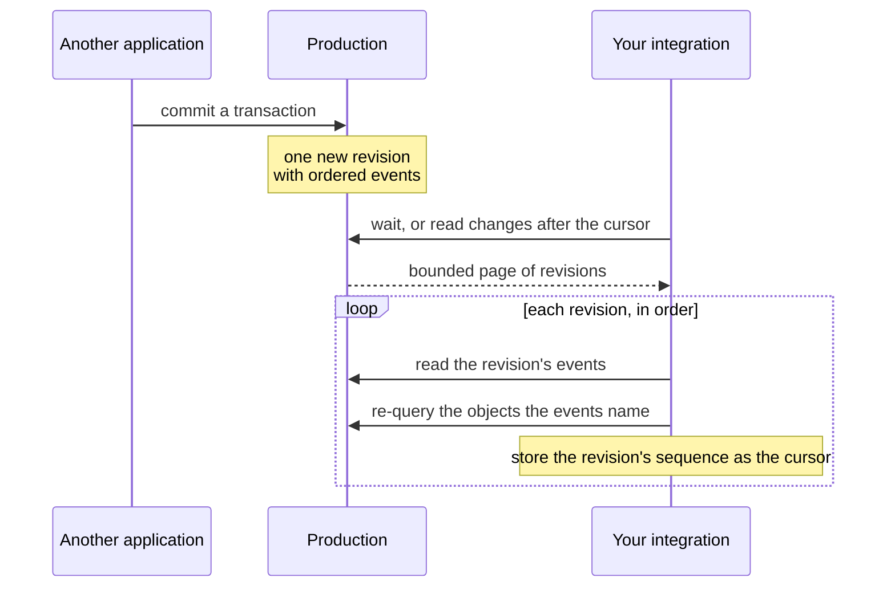

# Consuming the revision feed

Use the revision feed when an integration needs to refresh caches, update a UI,
or observe changes made by another tool sharing the same production file. Every
committed transaction becomes one revision with a production-local sequence
number and an ordered list of semantic events. Store the last fully processed
sequence as the local cursor.



## Polling safely

1. Request the revisions after the cursor with a bounded page size.
2. Process revisions in returned order.
3. Load each revision's events in position order.
4. Re-query objects needed by the integration.
5. Advance the local cursor only after the whole revision is processed.
6. Repeat until a page is shorter than the requested limit.

```{code-variants} revision-feed
```

Persisting the cursor after each complete revision gives at-least-once
processing after a consumer crash. Handlers should therefore tolerate seeing a
revision again. A cursor is meaningful only for the production that produced it.

## Following only some events

An editor that refreshes its media bin does not need to page through metadata
churn. Request the revisions that contain at least one event of the kinds you
care about. The page also returns a *through sequence*: every matching revision
up to it is included, so store it as the cursor even when the page is empty.
That skips long runs of unrelated revisions without reading them.

```{code-variants} revision-filter
```

A matching revision still carries all of its events; filter them when you load
them.

## Waiting for changes

Instead of polling on a timer, create a revision waiter and wait for the first
revisions after your cursor. A wait returns one of four results:

- **revisions** — a non-empty page, as `changes_since` would return it;
- **timed out** — nothing was committed within the timeout, at most 60 seconds;
  a zero timeout checks once without blocking;
- **closed** — the production the waiter was created from was closed; or
- **cancelled** — the waiter was cancelled, possibly from another thread.

Closed and cancelled are final for that waiter. The waiter sees commits made
through the same production immediately, and commits by other processes or
other handles on the same production file within about 100 ms. It uses its own
connection, so a blocked wait never delays other calls on the production.

```{code-variants} revision-wait
```

The C ABI exposes only the waiter and never calls back into your code. The C++
wrapper and Python add a `RevisionObserver`, shown above, that waits on a thread
it owns and calls your callback there with each revision and its events,
optionally only for chosen event kinds. Stop the observer before closing the
production, and marshal work to your UI thread yourself. Rust callers use the
waiter directly and may hand its canceller to another thread. The CLI command
`postproject revisions wait` performs one bounded wait and prints the result.

A wait is a wake-up signal, not a replacement for the cursor: after it returns,
process the revisions exactly as in the polling loop above and advance the
cursor only after each revision is handled.

## Events

Each event has a position within its revision and a typed payload, such as an
imported asset, an added representation or locator, an added or removed
external identifier or metadata property, or a created activity with its edges.
The surfaces expose the same payloads idiomatically:

- C returns a tagged `pp_revision_event_t` record; fields unused by an event
  kind are zero or `NULL`, and strings borrow the event set.
- C++ converts the record into a `std::variant` of event structs.
- Python returns frozen typed values such as `AssetImportedEvent`, suitable for
  `isinstance` dispatch.
- Rust returns `RevisionEventKind` enum values.
- The CLI prints events as JSON with `--json`.

Where the surface offers typed payloads, dispatch on the payload type rather
than on the numeric C event kinds.

## Attributing changes

A transaction may carry an optional *revision context*: an origin identity
(name, version, and URI of the integrating tool) and a short message. Set it
before committing, as shown in
[create a production and import media](first-production.md), so other
consumers of the feed can tell which tool made a change. CLI mutations use the
`postproject-cli` origin with the package version and a short operation
message.
