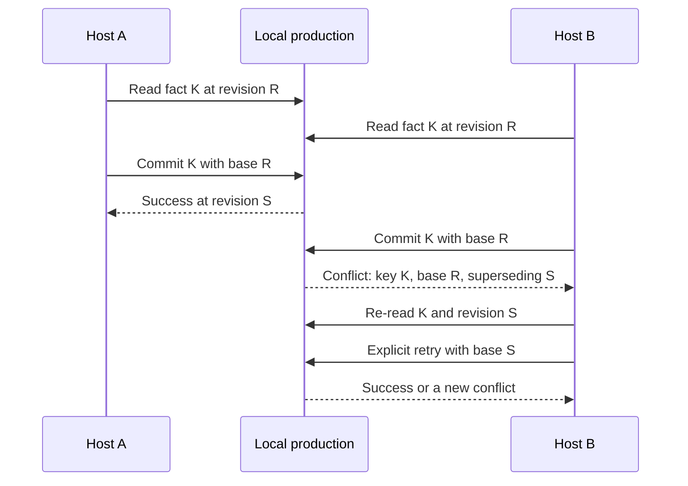

# Base revisions and semantic conflicts

Several processes can safely write one local production, but SQLite write
serialization alone cannot tell whether a host made a decision from stale
knowledge. When a write depends on previously read state, begin its transaction
with that state's revision ID.

A base revision is optimistic context, not a lock. It does not reserve the
production or reject unrelated work. Transactions without a base keep the
ordinary serialized-write behavior.

## Use a base for read–decide–write flows

The host flow is:

1. read the relevant objects and retain the latest revision;
2. let the application or user decide what to change;
3. begin a transaction at that revision;
4. stage and commit the change;
5. on conflict, inspect the structured detail and re-read current state; and
6. retry in a new transaction only after making the decision again.



The example deliberately makes one writer stale, inspects the semantic key and
both revisions, then performs an explicit retry:

```{code-variants} semantic-conflicts
```

For the CLI, `--base-revision REVISION_ID` applies the base to a mutating
command. With `--json`, an optimistic conflict is written to standard error as
JSON containing `key`, `base_revision_id`, `base_revision_sequence`,
`superseding_revision_id`, and `superseding_revision_sequence`.

## Conflicts follow semantic facts

PostProject does not compare only the production's latest revision. It checks
the non-mergeable facts touched by the transaction:

- the locator set of one resource;
- one metadata property on one object;
- the dependency set of one representation;
- one media root;
- one exact external-identifier attachment; and
- one resource or representation fingerprint algorithm/version domain.

Creating objects with new identities and appending independent facts can still
commit from an older base. For example, two hosts may add distinct assets or
media roots from the same base. Replacing the same locator set or changing the
same media root from that base produces exactly one successful update and one
conflict.

The complete per-operation classification is recorded in {doc}`ADR 0042
</adr/0042-semantic-write-conflicts>`. Job transitions retain their more
specific state, lease, and claim-token guards rather than becoming generic
optimistic conflicts.

## Treat the result as a new decision point

Conflict messages are diagnostic and may change. Branch on the stable error
category and structured conflict fields instead. The key says which fact
changed, while the superseding revision can be loaded or presented alongside
its revision origin.

A failed conflict commit changes nothing and closes that transaction. Do not
retry it automatically: the new value may represent another application's or
person's intentional decision. Re-read through the production handle, update
the host UI or policy input, and create a new transaction with a refreshed
base if the change is still wanted.

Set an `OriginIdentity` and useful message on every host-authored transaction.
Origin identifies the integrating application and optional version/URI; it is
not an authenticated user identity. It gives revision and conflict UI useful
context about which tool made the superseding change.

## Local shared-production boundary

The supported shared-write shape is multiple processes on one machine opening
the same local `.pproj` file. The revision waiter lets each process notice the
other's commits, and base revisions protect read–decide–write operations from
silent lost updates.

This contract does not cover network filesystems, remote services, access
control, distributed ordering, CRDTs, or automatic merging. Do not treat a
`.pproj` file as a network database.
