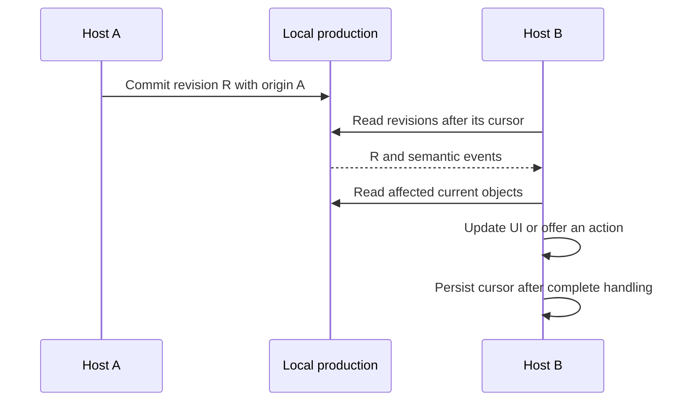

# Share one production between local applications

A shared production is one explicitly selected `.pproj` file opened by several
processes on one machine. It lets applications exchange media identity,
locations, representations, provenance, and revisions without reading one
another's project formats.

It is not a collaboration server. Do not place the file on a network
filesystem, infer it from another application's project directory, or treat a
SQLite write lock as an application-level conflict policy.

## Give every host the same explicit path

Each host needs a user-visible production selection. Store or pass the absolute
path as host configuration, not as media identity. Sidecar discovery can remain
a convenience for a single-host project, but it is not the shared-production
protocol.

The maintained acceptance path launches Kdenlive with an explicit production,
selects the same file in Blender's extension preferences, and gives the path to
the OpenAssetIO Manager:

```text
/show/edit/shared.pproj
        │
        ├── Kdenlive --postproject-production /show/edit/shared.pproj
        ├── Blender extension: Production file = /show/edit/shared.pproj
        └── OpenAssetIO setting: production_path = /show/edit/shared.pproj
```

Every process opens the file independently through an installed PostProject
package. None needs the other application's project file.

## Adopt identity; do not duplicate it

When a second host encounters media, follow {doc}`known-media-adoption` before
creating a new asset. Current locator or fingerprint evidence may identify
candidate assets. One match lets the host explicitly attach its own qualified
identifier to that asset; several matches remain a host/user decision.

Content equality is evidence about bytes, not proof that two logical assets
should be merged. Simultaneous first imports may therefore create distinct
assets, and PostProject never merges them implicitly.

## Observe cross-host work through revisions

Use {doc}`revision-feed` as an invalidation stream, then read current domain
objects. Do not reconstruct current state solely from event payloads. Revision
origin identifies the application and version that committed a change, while a
persisted sequence cursor makes consumption restartable.



A cross-process revision waiter can reduce latency, but correctness still comes
from reading after the durable cursor on startup and after every wake-up.

## Base decisions on the revision you read

If another process can change a non-mergeable fact, begin the write with the
revision on which the decision was based. Follow {doc}`semantic-conflicts` for
the complete host loop. A typed conflict means nothing committed: re-read the
fact and let the host or user decide whether to retry from the new revision.

Additive facts may still merge. For example, Kdenlive and Blender can attach
their differently qualified identifiers to one asset. Competing changes to one
resource's locator set share a semantic conflict key, so two decisions from one
base produce one success and one structured conflict.

## Keep generated-media provenance honest

Record a job only when the host exposes a real worker lifecycle. A host that can
observe only a completed render can instead record the existing output, its
input dependency, and the facts it actually observed. That output can be
current while remaining not reproducible from the recorded knowledge.

When source content changes, dependency snapshots let every host evaluate
affected outputs consistently. A proxy created by one application and a render
created by another can both become stale without either application parsing the
other's project.

## Supported boundary

The supported shared-production scope is deliberately local:

- one machine;
- one local SQLite `.pproj` file;
- several processes using public PostProject APIs;
- SQLite serialization plus PostProject semantic conflict detection.

Network filesystems, a database server, remote revision delivery, permissions,
authentication, automatic retries, and automatic asset merging are not part of
this contract.
