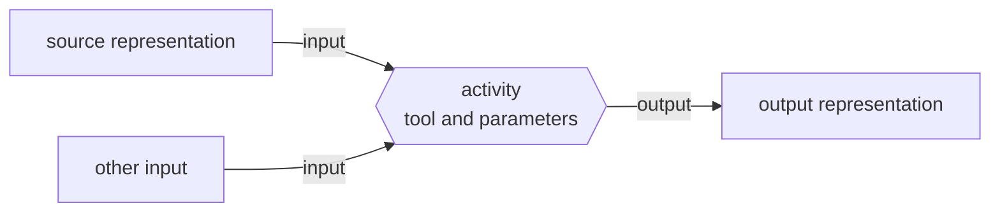

# Metadata and provenance

PostProject stores both descriptive knowledge and production history, but it keeps them distinct.

- **Metadata** answers questions such as “what do we know about this asset or representation?”
- **Provenance** answers questions such as “what activity used these inputs and produced these outputs?”

## Technical inspection

When `ffprobe` is available, media can be imported with technical inspection enabled (`--ffprobe PATH` selects another executable):

```sh
postproject media add production.pproj camera.mov --inspect
```

Inspection can contribute technical metadata without turning the inspector into the source of identity. The asset and representation remain production objects; inspected properties are knowledge attached to them.

## Metadata is vocabulary-aware

PostProject does not require every application to adopt one universal metadata dictionary. Instead, a metadata assertion identifies the vocabulary namespace and property it belongs to, and stores a typed value.

This allows applications to preserve well-known standard terms where appropriate while still using application- or production-specific namespaces when needed.

Unknown terms are not automatically invalid. The important properties are that the namespace is explicit, the value shape is preserved, and consumers do not silently reinterpret one vocabulary as another.

## External identifiers remain external

A PostProject object can also carry identifiers from outside the PostProject identity system. Their scheme and value should be preserved exactly.

A UMID, EIDR identifier, camera identifier, or host-application object ID is therefore not converted into a PostProject UUID and not treated as interchangeable with one.

## Provenance is activity-based

Production history is represented with activities and explicit inputs/outputs:



An activity can identify the tool and parameters involved where that information is available. This is more useful than trying to infer history from filenames such as `final_v7_REAL.mov`.

## Provenance is knowledge, not a claim of universal truth

A production records what its applications know. Missing history remains missing; PostProject should not invent an activity merely because two files look related.

Similarly, a processing activity does not automatically mean that two assets are editorial variants, revisions, or alternatives. Those relationships need their own explicit semantics when the model supports them.

## Derived artifacts and reproducibility

For managed outputs, provenance can be combined with fingerprint observations and dependency knowledge to answer richer questions:

- Do we know which activity produced this output?
- Are the expected inputs still the same?
- Has an upstream dependency changed?
- Is the output current, stale, indeterminate, or diverged?
- Is there enough information to reproduce it?

Those evaluations describe production knowledge. They do not themselves run FFmpeg, Blender, a render farm, or another media-processing system.

For exact integration operations, continue with {doc}`../integrators/metadata-vocabularies` and {doc}`../integrators/provenance`.
